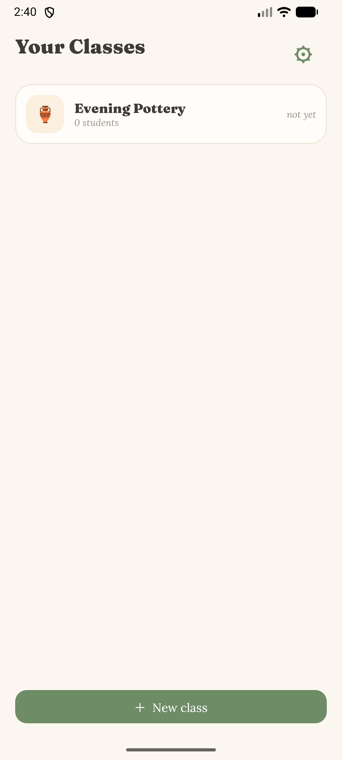
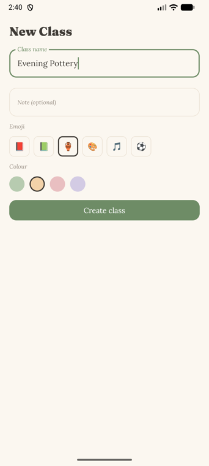
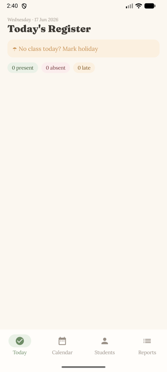

<p align="center">
  
</p>

<h1 align="center">YesMaam</h1>

<p align="center">
  A calm, offline attendance app for teachers — serif type, soft pastels, and one-tap monthly reports in <b>Excel</b> and <b>PDF</b>.
</p>

<p align="center">
  
  
  
  
  
</p>

---

Keep a class for anything — a school section, a pottery course, a weekend workshop. Tap who's
here, mark the holidays, and at month's end hand out a tidy spreadsheet or a printable register.
Everything stays on the device; there are no accounts and no network.

## Screenshots

<p align="center">
  
  &nbsp;&nbsp;
  
  &nbsp;&nbsp;
  
</p>

## Features

- **Any kind of class** — create classes with a name, emoji, and pastel colour (school, course, club…).
- **One-tap attendance** — mark each student **Present / Absent / Late**; it auto-saves as you tap.
- **Roster** — name, roll number, and an optional guardian phone per student.
- **Holidays** — mark a day off per class; it's painted on a month **calendar** and excluded from the totals.
- **Monthly reports** — export **Excel (`.xlsx`)** and **PDF**, shared through the Android share sheet.
- **Offline & on-device** — Room database, no login, no cloud, no permissions needed to share.
- **Serif + pastel design system** — Fraunces & Lora type on a warm paper palette ([`docs/design-system.md`](docs/design-system.md)).

## How it works

A **session day** is simply any day you actually took attendance (and didn't mark as a holiday).
That one rule keeps everything else honest:

- **Attendance %** for a student = `(present + late) / number of session days`.
- A missing mark on a session day counts as **absent**.
- **Holidays** are excluded from session days and shown as `H` in reports.
- **Weekends aren't special-cased** — if you don't teach Saturday you simply never take attendance
  then, so it never counts; a Saturday class works exactly the same way.

Reports are produced from a pure, unit-tested `ReportBuilder`, then handed to pluggable
exporters — so adding a new format (e.g. CSV) is a single new class behind the same interface.

## Tech stack

| Area | Choice |
|------|--------|
| Language / UI | Kotlin · Jetpack Compose · Material 3 |
| Persistence | Room (KSP) |
| Navigation / state | navigation-compose · Lifecycle `ViewModel` + `Flow` |
| Dates | `java.time` via core-library desugaring (minSdk 24) |
| Dependency injection | Manual (`AppContainer`) — no Hilt |
| Excel export | Hand-rolled minimal OOXML writer (no Apache POI) |
| PDF export | `android.graphics.pdf.PdfDocument` + bundled serif fonts |
| Sharing | `FileProvider` + `ACTION_SEND` (no runtime permissions) |

## Architecture

Light MVVM in a single `:app` module:

```
data/      Room entities, DAOs, AttendanceRepository, SettingsStore
domain/    pure models + report/ (ReportBuilder, MonthlyReport)
export/    ReportExporter interface, Excel + PDF exporters, FileProvider delivery
ui/        theme/ (design system), nav/, components/, screens (classes, classroom tabs, settings)
di/        AppContainer (manual DI)
```

Data flows Screen → ViewModel → Repository → Room and back via `Flow`. The report core has no
Android dependencies, so the trickiest logic is tested on the plain JVM.

## Build & run

**Requirements:** Android Studio (or the command line) with a JDK 17+ and the Android SDK; an
emulator or device on API 24+.

```bash
# clone
git clone https://github.com/kanishkdebnath/YesMaam.git
cd YesMaam

# build a debug APK
./gradlew :app:assembleDebug

# install onto a running emulator / connected device
./gradlew :app:installDebug
```

Or just open the project in Android Studio and press **Run**.

## Tests

```bash
# fast JVM unit tests: report logic, XLSX writer, exporter mapping
./gradlew :app:testDebugUnitTest

# instrumented tests (need an emulator/device): Room cascade + upsert, PDF output
./gradlew :app:connectedDebugAndroidTest
```

## Roadmap

Deliberately out of scope for v1, easy to add later:

- Back-dated attendance editing from the calendar (the repository already accepts any date)
- CSV export · save-to-Downloads
- Dark theme · bulk student import · cloud sync / multi-teacher

## Design docs

- [`docs/design-system.md`](docs/design-system.md) — palette, type scale, components
- [`docs/superpowers/specs/`](docs/superpowers/specs) — the approved design spec
- [`docs/superpowers/plans/`](docs/superpowers/plans) — the phased implementation plan
- [`docs/mockups/index.html`](docs/mockups/index.html) — original HTML mockups

---

<p align="center"><i>Built as a small, focused MVP — minimal code, calm UI.</i></p>
